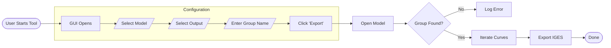

## Siemens NX Composite Curve Python Automation

[](https://www.python.org/)
[](https://plm.sw.siemens.com/en-US/nx/)
[](https://github.com/)
[]()

A Python-based engineering tool that automates the extraction of composite curves from Siemens NX CAD models, reducing manual pre-processing time by 90%

## Demo

<div align="center">
  
</div>

<div align="center">
  <h3>
    <a href="demo/NX_Python Script Running Video.mp4">📺 Click here to watch the full High-Quality Video</a>
  </h3>
</div>

## Problem Statement
In Aerospace,Wind and automotive composite workflows, engineers must prepare CAD geometry for downstream manufacturing activities like (Layup planning, Material Cutting and Kitting, Laser projection, etc.).

**The Manual Process**
1.  Engineers manually identify curve boundaries on complex surfaces in 3D Model.
2.  They use point-and-click operations to extract curves one by one and save this individually.
3.  **Result:** This takes **30-40 minutes per part** and is prone to human selection errors.

## The Solution
I developed a Python script utilizing the **NXOpen API** to programmatically export the geometry. By inputting a single Feature Group, the algorithm detects, filters, and extracts the necessary composite curves automatically from the selected group.

**Key Benefits:**
**Efficiency:** Reduces extraction time from minutes to seconds.
**Repeatability:** Removes human variability; the output is standard every time.
**Scalability:** Capable of processing complex assemblies that would be tedious to handle manually.

## Architecture & Logic

The script follows a modular extraction pipeline:


## Technical Implementation Details

The application is built on a **hybrid architecture** combining a standard Python GUI (Tkinter) with the proprietary **Siemens NXOpen API**.

#### 1. NX Environment Integration
* **Custom Environment Configuration:** The script dynamically re-maps `TCL_LIBRARY` and `TK_LIBRARY` paths at runtime. This resolves conflicts between the standard Python interpreter and Siemens NX's embedded Tcl/Tk environment, ensuring the GUI renders correctly.
* **Session Management:** Utilizes `NXOpen.Session.GetSession()` to hook into the active CAD instance, allowing real-time manipulation of loaded parts.

#### 2. The Extraction Algorithm
The core logic (`_nx_export_composite_curves`) follows a robust selection pipeline:
* **Part Traversal:** Iterates through a user-defined list of `.prt` files, opening them via `Parts.OpenActiveDisplay`.
* **Smart Filtering:** * Traverses the **Feature Tree** (`work_part.Features`).
    * Identifies `NXOpen.Features.FeatureGroup` objects matching the user's input string.
    * Extracts specific `CompositeCurve` members using `.GetMembers()`, ignoring irrelevant geometry.
* **IGES Export Automation:**
    * Instantiates the `DexManager` (Data Exchange Manager).
    * Configures the `IgesCreator` class programmatically (setting `BcurveTol`, `ObjectTypes.Curves`, and `ReferenceType`).
    * Executes the export commit without triggering UI dialogs (Headless execution).

#### 3. Memory & Resource Management
* **Clean Garbage Collection:** Implements a strict `_nx_close_part` routine using `NewPartCloseResponses` to force-close parts after processing. This prevents RAM bloating and "Part Modified" warnings during large batch jobs.
* **Event Loop Management:** uses manual `self.update()` calls within the processing loop to prevent the Tkinter GUI from freezing ("Not Responding") during synchronous NX operations.

## Code Snippet
*The core logic that filters Feature Groups and configures the IGES exporter:*

```python
def _nx_export_composite_curves(self, part_file_path, output_dir):
    # ... (Session setup omitted for brevity) ...

    # 1. Feature Group Filtering Logic
    if target_group_name:
        for feature in work_part.Features:
            # Check if feature matches name AND is a Feature Group
            if feature.Name.upper() == target_group_name.upper():
                if isinstance(feature, NXOpen.Features.FeatureGroup):
                    # Extract members specifically from this group
                    members = feature.GetMembers()
                    for member in members:
                        if isinstance(member, NXOpen.Features.CompositeCurve):
                            composite_curve_features.append(member)

    # 2. Programmatic IGES Configuration
    igesCreator = self.theSession.DexManager.CreateIgesCreator()
    igesCreator.ExportModelData = True
    igesCreator.ObjectTypes.Curves = True
    igesCreator.BcurveTol = 0.0508  # Set precise tolerance
    
    # 3. Export Execution
    igesCreator.OutputFile = output_path
    igesCreator.Commit()
    igesCreator.Destroy()
```
## Source Code & Collaboration
This project is currently closed-source for portfolio demonstration.

The full source code (Python scripts, NXOpen implementation, and Tkinter GUI) is available for Code Review or Collaboration upon request.

**How to Request Access**
I am actively looking for collaborators and feedback! If you are a hiring manager or developer interested in the technical details:

Email: [Aneesh.binage06@gmail.com]

LinkedIn: [https://www.linkedin.com/in/aneesh-shridhar-b-165468154/]

Upon request, I can add you as a Collaborator to the repository or provide a secure code walkthrough.


## About the Author

**Aneesh Shridhar B**
*Masters Student in Intelligent Manufacturing @ TU Clausthal, Germany| Composite Design & Manufacturing Engineer*

With over **6 years of industrial experience** at global leaders like **General Electric, Tata Advanced Systems, and Enercon GmbH**, I specialize in bridging the gap between physical composite manufacturing and digital automation.

My expertise lies in optimizing aerospace and wind energy workflows, moving from traditional design to Industry 4.0 implementation.

* **Core Domain:** Manufacturing Engineering, Composite Design (CATIA/NX), and Digital Manufacturing.
* **Specialized Tech:** CATIA V5, Siemens NX, Laser Projection Systems, Process Vision (Ply placement verification & wrinkle detection).
* **Automation:** Python scripting for CAD/CAM (NXOpen, CATIA Automation).
